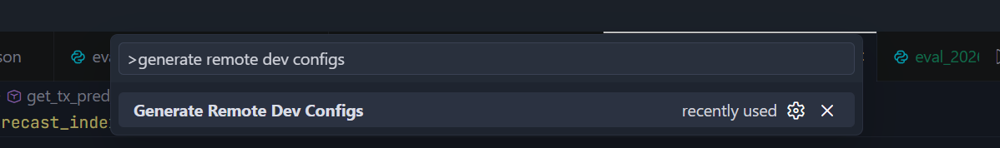
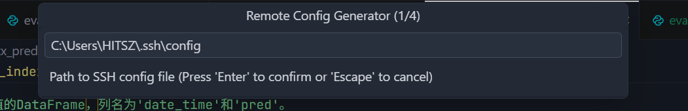
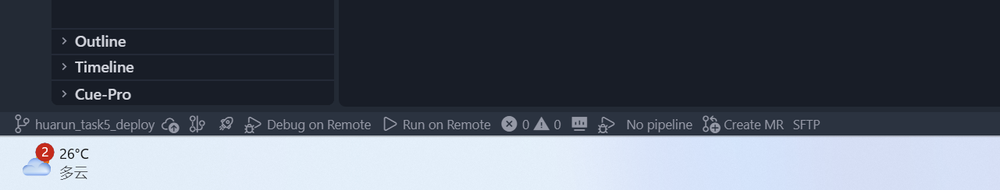
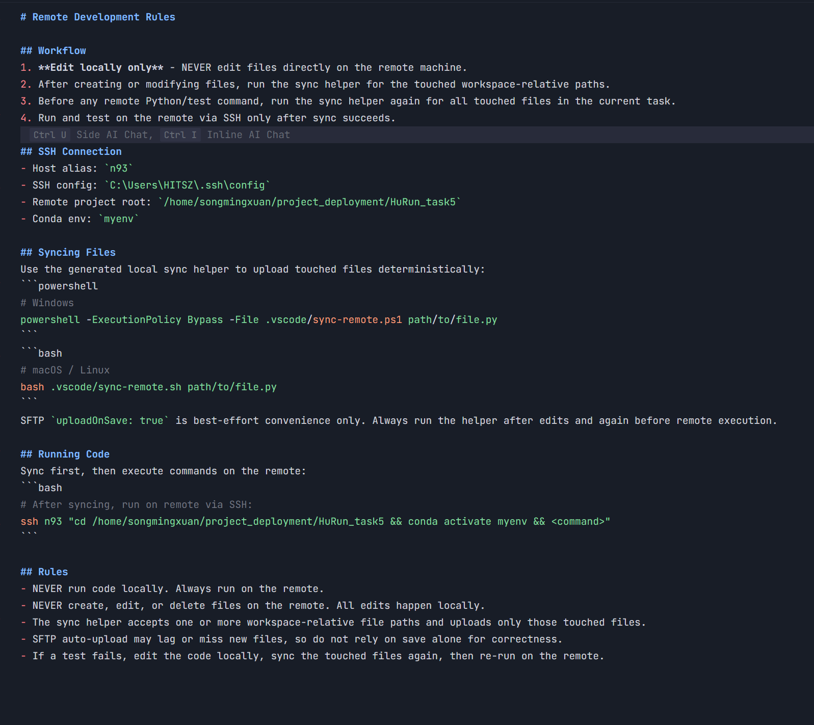

# Remote Config Generator — Getting Started

A Trae/VS Code extension for PyCharm-style remote Python development: edit locally, run and debug on a remote machine over SSH using a conda environment as the interpreter.

> **Note:** Currently supports **Python only**. Tested on **Windows**; macOS/Linux support is built in but not yet verified (feedback welcome).

---

## One-Time Setup

### Step 1 — Open the command palette

Press `Ctrl+Shift+P` and select **"Generate Remote Dev Configs"**.

### Step 2 — Choose your SSH config file

The plugin reads your `~/.ssh/config` to find available remote hosts. Select the SSH config file on your machine (the default path is usually correct).

### Step 3 — Configure the remote connection

Follow the remaining prompts:

1. **Select SSH host** — pick the remote machine you want to connect to (parsed from your SSH config).
2. **Remote project root** — the absolute path on the remote where your project lives (e.g., `/home/you/myproject`).
3. **Conda environment** — the plugin auto-detects conda environments on the remote and shows them as a list. If detection fails, you can type the environment name manually.

### Step 4 — Done

The plugin generates all necessary config files:

- `.vscode/launch.json` — debug attach configuration
- `.vscode/tasks.json` — run/sync tasks
- `.vscode/sync-remote.ps1` / `.sh` — file sync helpers
- `.vscode/remote-debug.ps1` / `.sh` — debug launch helpers
- `.claude/rules/sshrule.md`, `.trae/rules/sshrule.md`, `AGENTS.md` — AI agent rules

You only need to do this once per workspace.

---

## Daily Usage

After setup, two buttons appear in the **bottom-left status bar** of Trae:

### Run on Remote

Click **`▶ Run on Remote`** to sync the active Python file to the remote and execute it. Output appears in a terminal. Stop with `Ctrl+C` or the trash icon.

### Debug on Remote

1. Open a `.py` file and set a **breakpoint** (click the gutter next to a line number — a red dot appears).
2. Click **`▶ Debug on Remote`**.
3. The plugin syncs the file, starts the debugger on the remote, and attaches automatically.
4. When the breakpoint hits, you can step through code (`F10`/`F11`), inspect variables, and evaluate expressions — just like PyCharm's remote interpreter.

### AI Agent Support

After setup, AI agents (Claude Code, Trae's built-in agent, Codex) can run and test your code on the remote automatically. The generated rule files teach agents to edit locally and execute via SSH — no extra configuration needed.

---

## Troubleshooting

| Problem | Solution |
|---|---|
| Conda env detection fails | The plugin falls back to manual entry. Type the env name and conda root path (e.g., `~/miniconda3`). |
| "No .vscode/remote-config-gen.json found" | Re-run the setup wizard (`Ctrl+Shift+P` → "Generate Remote Dev Configs"). |
| Port 5678 already in use | The plugin auto-cleans stale debugpy processes. If it persists, run: `ssh <host> "lsof -ti tcp:5678 \| xargs -r kill"` |
| F5 doesn't start debugging | F5 alone won't work — use the **`▶ Debug on Remote`** status bar button instead. |
| Output channel shows no ssh output | Check the "Remote Debug" output channel (View → Output → select "Remote Debug") for diagnostic details. |
